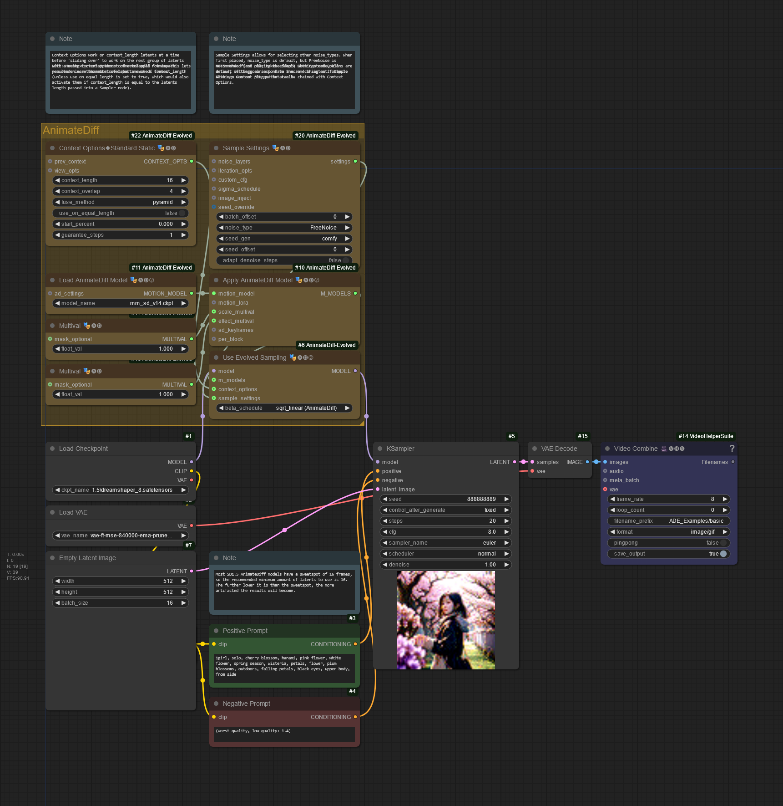
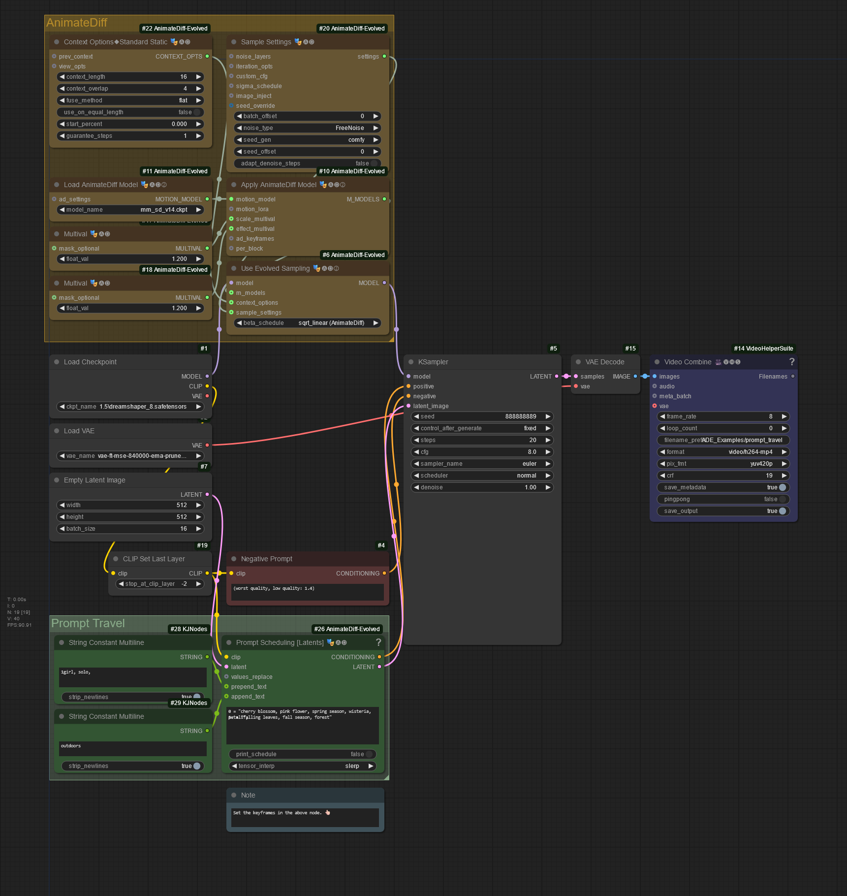
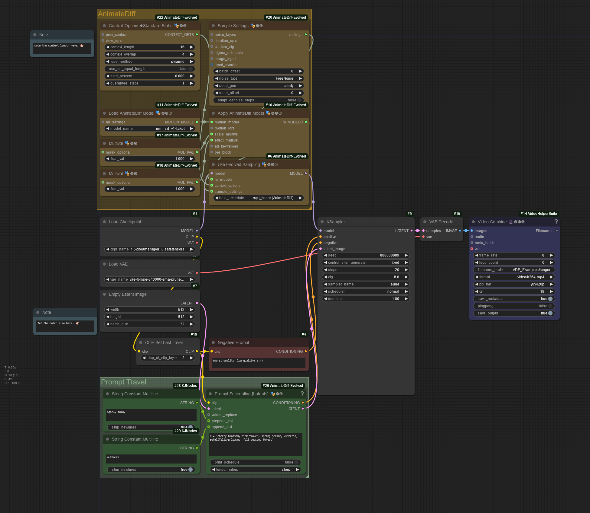
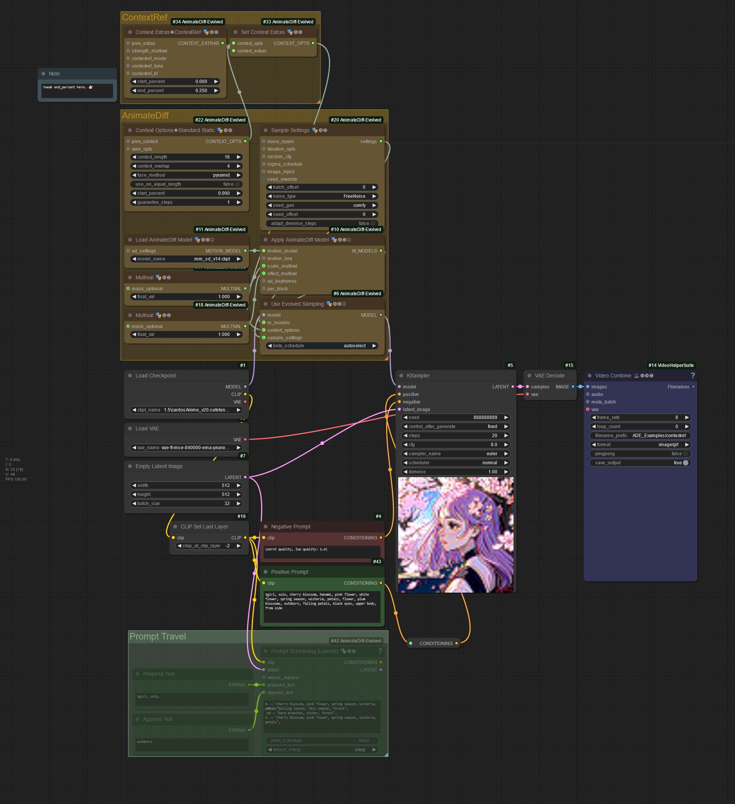
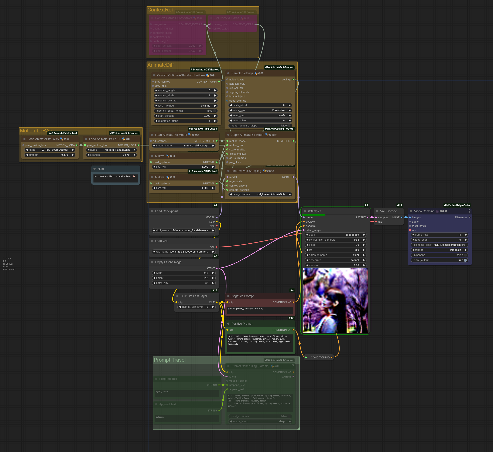
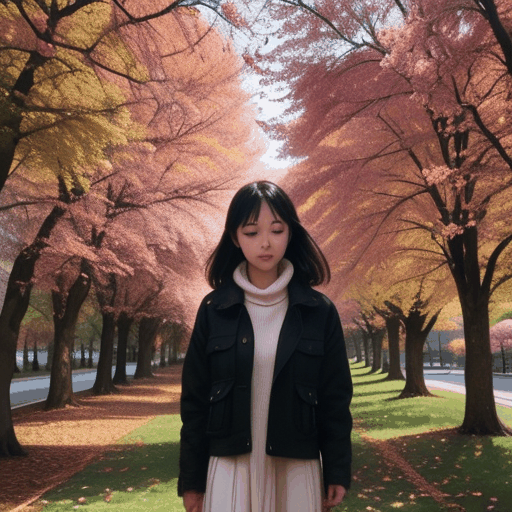

# AnimateDiff Evolved Examples

See the Wiki for more detail.

## [Basic txt2vid](./workflows/ade_basic.png)

Workflow Image

Slightly more than the bare minimum.

- Context Options
- Sample Settings
- Apply AnimateDiff Model
- Use Evolved Sampling

## [+ Prompt Travel](./workflows/ade_prompt_travel.png)

Workflow Image

Same as above, but with prompt travel.

- Prompt Scheduling [Latents]

## [+ context_length (32 frames)](./workflows/ade_longer.png)

Workflow Image

A longer generation that uses a sliding window of 16 frames.

## [+ ContextRef](./workflows/ade_contextref.png)

Workflow Image

- Set Context Extras
- Context Extras - ContextRef

### No ContextRef

### ContextRef

## [+ Motion LoRAs](./workflows/ade_motion_loras.png)

Workflow Image

- Load AnimateDiff LoRA 🎭🅐🅓
- Zoom Out
- Pan Left

## [+ Latent Upscale](./workflows/ade_upscale_1.png)

Workflow Image

- Classic Upscaling
  
 